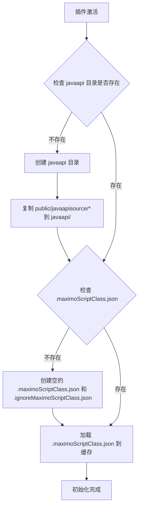
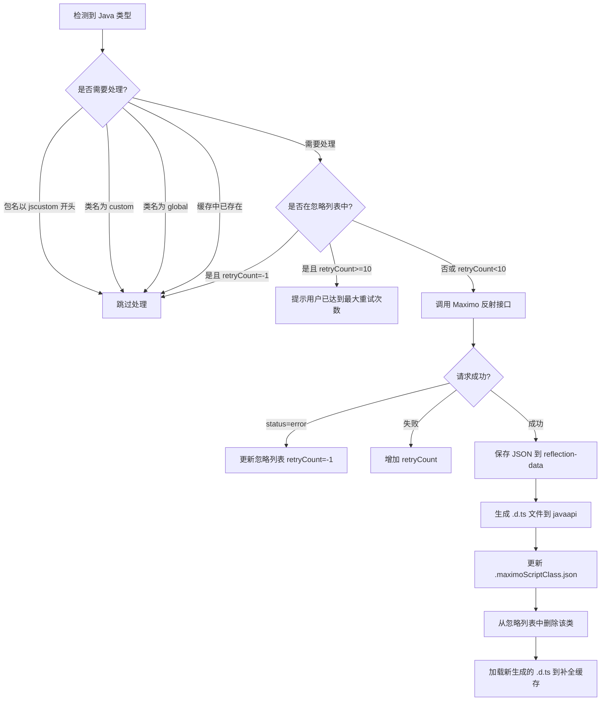

# Maximo 反射 API 自动生成实现方案

## 📋 需求概述

在"maximo配置"的"补全设置"页面中，"启用类型推断"下方添加一个勾选框"自动生成反射API"（需要Maximo接口才会生效）。

该功能通过调用 Maximo 的 `SKS_REFLECT_HELPER` 接口获取 Java 类的反射信息，并自动生成本地的 `.d.ts` 类型定义文件，提升代码补全体验。

---

## 🎯 核心概念

### 目录说明

- **reflection-data**: 存放通过 Java 反射获取的 JSON 文件（按包名分目录）
- **javaapi**: 存放通过 Java 反射获取的 `.d.ts` 文件（TypeScript 类型定义）

### 持久化存储文件

#### 1. `.maximoScriptClass.json`
- **位置**: `javaapi/.maximoScriptClass.json`
- **作用**: 存储已成功获取反射信息的类名列表
- **格式**: 字符串数组
```json
[
  "com.ibm.tivoli.maximo.script.ScriptService",
  "psdi.mbo.MboRemote",
  "psdi.mbo.MboSetRemote"
]
```

#### 2. `.ignoreMaximoScriptClass.json`
- **位置**: `javaapi/.ignoreMaximoScriptClass.json`
- **作用**: 存储获取失败的类名和重试次数
- **规则**:
  - `retryCount: -1` → 永久忽略（类不存在）
  - `retryCount >= 10` → 达到最大重试次数，保留次数可查看
  - `retryCount < 10` → 继续重试
- **格式**: 对象数组
```json
[
  {
    "className": "com.ibm.tivoli.maximo.script.ScriptService1",
    "retryCount": -1,
    "reason": "无法加载类"
  },
  {
    "className": "com.example.NonExistentClass",
    "retryCount": 5,
    "reason": "连接超时"
  }
]
```

---

## 🚀 插件启动逻辑

### 步骤流程图



### 详细步骤

1. **检查 javaapi 目录**
   - 路径: `<用户主目录>/.sks/maximo-script-helper/javaapi/`
   - 如果不存在，创建目录
   - 将 `public/javaapisource/` 下的所有文件和子目录复制到 `javaapi/`
     - `custom.d.ts`
     - `global.d.ts`
     - `jscustom/` 目录及其内容

2. **检查元数据文件**
   - 检查 `javaapi/.maximoScriptClass.json` 是否存在
   - 如果不存在，创建两个空文件：
     ```typescript
     // .maximoScriptClass.json
     []
     
     // .ignoreMaximoScriptClass.json
     []
     ```

3. **加载缓存**
   - 读取 `.maximoScriptClass.json` 内容
   - 加载到内存缓存 `Set<string>` 中
   - 用于快速判断某个类是否已处理过

---

## ⚙️ 自动生成反射 API 逻辑

### 触发条件

当用户在 JS 文件中编写代码时，completionProvider 检测到 Java 类型引用：

```javascript
/** @type {com.ibm.tivoli.maximo.script.ScriptService} */
var service;

service. // ← 触发补全时
```

### 处理流程



### 详细步骤

#### 1. 过滤不需要处理的类

以下情况直接跳过：
- 包名以 `jscustom` 开头（自定义脚本类）
- 类名为 `custom` 或 `global`（特殊类）
- 缓存中已存在（`.maximoScriptClass.json` 中包含该类名）

#### 2. 防抖机制

- **规则**: 同一个类在 5 秒内只触发一次反射请求
- **实现**: 使用 `Map<string, number>` 记录上次请求时间戳
- **目的**: 避免频繁请求 Maximo 接口

#### 3. 调用 Maximo 反射接口

**接口地址**: `script/SKS_REFLECT_HELPER`

**请求示例**:
```bash
curl --request POST \
  --url script/SKS_REFLECT_HELPER \
  --header 'Content-Type: application/json' \
  --header 'apiKey: YOUR_API_KEY' \
  --data '{
    "className": "com.ibm.tivoli.maximo.script.ScriptService"
  }'
```

**成功响应**:
```json
{
  "className": "com.ibm.tivoli.maximo.script.ScriptService",
  "superClass": "java.lang.Object",
  "interfaces": ["com.ibm.ism.script.ScriptServiceRemote"],
  "methods": [
    {
      "name": "log",
      "returnType": "void",
      "parameters": ["java.lang.String"],
      "description": "记录日志信息",
      "modifiers": "public",
      "isStatic": false,
      "isPublic": true
    }
  ]
}
```

**失败响应** (类不存在):
```json
{
  "status": "error",
  "message": "error#无法加载类: com.ibm.tivoli.maximo.script.ScriptService1 - com.ibm.tivoli.maximo.script.ScriptService1"
}
```

#### 4. 保存 JSON 数据到 reflection-data

**目录结构**:
```
~/.sks/maximo-script-helper/reflection-data/
├── com/
│   └── ibm/
│       └── tivoli/
│           └── maximo/
│               └── script/
│                   └── ScriptService.json
├── psdi/
│   └── mbo/
│       ├── MboRemote.json
│       └── MboSetRemote.json
└── java/
    └── lang/
        └── Object.json
```

**保存逻辑**:
- 根据类名的包路径创建目录
- 例如: `com.ibm.tivoli.maximo.script.ScriptService` → `com/ibm/tivoli/maximo/script/ScriptService.json`
- 文件名与类名保持一致（不含包名）

#### 5. 生成 .d.ts 文件到 javaapi

**参考模板**: `javaapi/jscustom/AnsiLogger.d.ts`

**生成规则**:
- 保持与 JSON 相同的目录结构
- 文件扩展名改为 `.d.ts`
- 使用 TypeScript 声明语法

**示例输出**:
```typescript
// com/ibm/tivoli/maximo/script/ScriptService.d.ts

declare namespace com.ibm.tivoli.maximo.script {
    /**
     * Maximo 自动化脚本服务类
     */
    class ScriptService {
        /**
         * 记录日志信息
         * @param message 日志消息
         */
        log(message: string): void;
        
        /**
         * 记录错误信息
         * @param message 错误消息
         */
        error(message: string): void;
        
        /**
         * 获取 MBO 集合
         * @param objectName 对象名称
         * @param userInfo 用户信息
         */
        getMboSet(objectName: string, userInfo: psdi.security.UserInfo): psdi.mbo.MboSetRemote;
    }
}
```

**特殊处理**:
- 参数类型简化: `java.lang.String` → `string`
- 返回类型映射: 
  - `void` → `void`
  - `java.lang.String` → `string`
  - `int` → `number`
  - `boolean` → `boolean`
  - `psdi.mbo.MboRemote` → `psdi.mbo.MboRemote` (保持完整类名)
- 添加 JSDoc 注释

#### 6. 更新元数据文件

**.maximoScriptClass.json**:
```json
[
  "com.ibm.tivoli.maximo.script.ScriptService",
  "psdi.mbo.MboRemote"
]
```

**.ignoreMaximoScriptClass.json**:
- 如果之前在该文件中，删除对应条目
- 如果获取成功，确保不在忽略列表中

#### 7. 重新加载补全缓存

- 调用 `completionProvider.loadLocalApiData()`
- 重新扫描 `javaapi/` 目录下的所有 `.d.ts` 文件
- 更新内部缓存，使新生成的类型立即可用

---

## 🔧 技术实现细节

### 1. 配置文件管理模块

**新建文件**: `src/reflectionDataManager.ts`

**核心功能**:
```typescript
export class ReflectionDataManager {
  private reflectionDataPath: string;  // reflection-data 目录
  private javaapiPath: string;          // javaapi 目录
  private cachedClasses: Set<string>;   // 已处理的类名缓存
  private ignoredClasses: Map<string, { retryCount: number; reason: string }>; // 忽略列表
  private lastRequestTime: Map<string, number>; // 防抖记录
  
  // 初始化
  async initialize(): Promise<void>;
  
  // 检查类是否需要处理
  shouldProcessClass(className: string): boolean;
  
  // 标记类为已处理
  markClassAsProcessed(className: string): Promise<void>;
  
  // 添加到忽略列表
  addToIgnoreList(className: string, reason: string, isPermanent: boolean): Promise<void>;
  
  // 检查是否在防抖期内
  isInDebouncePeriod(className: string): boolean;
  
  // 记录请求时间
  recordRequestTime(className: string): void;
}
```

### 2. Maximo 反射接口调用

**集成到现有 httpRequest 模块**:

```typescript
// src/httpRequest.ts 中添加
export async function fetchClassReflection(
  className: string,
  logger: vscode.LogOutputChannel
): Promise<any> {
  const result = await httpRequestToMaximo({
    url: 'script/SKS_REFLECT_HELPER',
    method: 'POST',
    data: { className },
    logger
  });
  
  return result.data;
}
```

### 3. JSON 转 .d.ts 生成器

**新建文件**: `src/dtsGenerator.ts`

**核心功能**:
```typescript
export class DtsGenerator {
  /**
   * 将反射 JSON 数据转换为 .d.ts 文件内容
   */
  generateDtsContent(reflectionData: any): string;
  
  /**
   * 简化 Java 类型为 TypeScript 类型
   */
  simplifyJavaType(javaType: string): string;
  
  /**
   * 生成方法签名
   */
  generateMethodSignature(method: MethodInfo): string;
  
  /**
   * 生成 JSDoc 注释
   */
  generateJsDoc(method: MethodInfo): string;
}
```

**类型映射表**:
```typescript
const JAVA_TO_TS_TYPE_MAP: Record<string, string> = {
  'java.lang.String': 'string',
  'java.lang.Integer': 'number',
  'java.lang.Long': 'number',
  'java.lang.Double': 'number',
  'java.lang.Float': 'number',
  'java.lang.Boolean': 'boolean',
  'java.lang.Object': 'any',
  'void': 'void',
  'int': 'number',
  'long': 'number',
  'double': 'number',
  'float': 'number',
  'boolean': 'boolean',
  'byte': 'number',
  'short': 'number',
};
```

### 4. UI 配置项添加

**修改文件**: `webview-ui/src/App.tsx`

在"补全设置"标签页中，"启用类型推断"下方添加:

```tsx
<div className="config-item">
  <label className="checkbox-label">
    <input
      type="checkbox"
      checked={config.autoGenerateReflectionApi || false}
      onChange={(e) => updateConfig({ autoGenerateReflectionApi: e.target.checked })}
    />
    <span>自动生成反射API</span>
  </label>
  <p className="config-hint">
    开启后，当检测到 Java 类型时，会自动调用 Maximo 接口获取反射信息并生成本地类型定义文件
    （需要 Maximo 系统中已部署 SKS_REFLECT_HELPER 脚本）
  </p>
</div>
```

**package.json 配置项**:
```json
{
  "configuration": {
    "properties": {
      "maximoScript.autoGenerateReflectionApi": {
        "type": "boolean",
        "default": false,
        "description": "自动生成反射API（需要Maximo接口支持）"
      }
    }
  }
}
```

### 5. CompletionProvider 集成

**修改文件**: `src/completionProvider.ts`

在 `getReflectionSuggestions` 方法中添加逻辑:

```typescript
private async getReflectionSuggestions(
  className: string,
  position: vscode.Position
): Promise<vscode.CompletionItem[]> {
  // ... 现有三层降级策略 ...
  
  // 新增：如果启用了自动生成反射API，尝试动态获取
  if (this.config.autoGenerateReflectionApi) {
    const reflectionManager = this.getReflectionDataManager();
    
    if (reflectionManager.shouldProcessClass(className)) {
      // 异步触发反射获取（不阻塞当前补全）
      this.triggerReflectionFetch(className).catch(err => {
        this.log(`后台反射获取失败: ${err}`, 'warn');
      });
    }
  }
  
  // ... 返回现有结果 ...
}

private async triggerReflectionFetch(className: string): Promise<void> {
  const reflectionManager = this.getReflectionDataManager();
  
  // 防抖检查
  if (reflectionManager.isInDebouncePeriod(className)) {
    return;
  }
  
  reflectionManager.recordRequestTime(className);
  
  try {
    // 调用 Maximo 接口
    const reflectionData = await fetchClassReflection(className, this.outputChannel);
    
    if (reflectionData.status === 'error') {
      // 类不存在，永久忽略
      await reflectionManager.addToIgnoreList(
        className,
        reflectionData.message,
        true
      );
      return;
    }
    
    // 保存 JSON 数据
    await this.saveReflectionJson(className, reflectionData);
    
    // 生成 .d.ts 文件
    await this.generateDtsFile(className, reflectionData);
    
    // 更新元数据
    await reflectionManager.markClassAsProcessed(className);
    
    // 重新加载补全缓存
    this.loadLocalApiData();
    
    this.log(`✅ 自动生成反射API成功: ${className}`);
  } catch (error: any) {
    // 临时失败，增加重试次数
    await reflectionManager.addToIgnoreList(
      className,
      error.message,
      false
    );
    this.log(`❌ 自动生成反射API失败: ${className} - ${error.message}`, 'error');
  }
}
```

---

## 📁 文件结构总览

### 新增文件

```
src/
├── reflectionDataManager.ts      # 反射数据管理器（新建）
├── dtsGenerator.ts                # .d.ts 文件生成器（新建）

webview-ui/src/
├── App.tsx                        # 添加配置项UI（修改）

package.json                       # 添加配置项定义（修改）
```

### 数据存储目录

```
~/.sks/maximo-script-helper/
├── javaapi/                       # TypeScript 类型定义目录
│   ├── .maximoScriptClass.json    # 已处理的类名列表
│   ├── .ignoreMaximoScriptClass.json  # 忽略列表
│   ├── custom.d.ts                # 从 public/javaapisource 复制
│   ├── global.d.ts                # 从 public/javaapisource 复制
│   ├── jscustom/                  # 从 public/javaapisource 复制
│   │   ├── AnsiLogger.d.ts
│   │   └── ...
│   ├── com/                       # 自动生成的类
│   │   └── ibm/
│   │       └── tivoli/
│   │           └── maximo/
│   │               └── script/
│   │                   └── ScriptService.d.ts
│   └── psdi/
│       └── mbo/
│           ├── MboRemote.d.ts
│           └── MboSetRemote.d.ts
│
└── reflection-data/               # JSON 原始数据目录
    ├── com/
    │   └── ibm/
    │       └── ...
    └── psdi/
        └── mbo/
            ├── MboRemote.json
            └── MboSetRemote.json
```

---

## ⚠️ 注意事项

### 1. 性能优化

- **防抖机制**: 同一类 5 秒内只请求一次
- **异步处理**: 反射获取在后台进行，不阻塞当前补全
- **缓存优先**: 优先使用本地缓存，避免重复请求

### 2. 错误处理

- **类不存在**: 检测到 `status: "error"` 时，永久忽略（retryCount = -1）
- **网络失败**: 临时失败时增加重试次数，最多 10 次
- **超时处理**: 设置合理的请求超时时间（建议 10 秒）

### 3. 用户体验

- **静默处理**: 后台反射获取失败时，不影响当前补全功能
- **日志记录**: 详细记录反射获取过程，便于调试
- **状态提示**: 在输出通道中显示生成进度

### 4. 兼容性

- **向后兼容**: 默认关闭该功能，不影响现有用户
- **渐进增强**: 即使用户未开启，也不影响其他补全功能
- **配置灵活**: 用户可以随时开启或关闭该功能

### 5. 安全考虑

- **认证复用**: 使用现有的 MAXAUTH 或 API Key 认证
- **敏感信息**: 不记录完整的请求/响应内容到日志
- **权限控制**: 依赖 Maximo 接口的权限控制

---

## 🧪 测试计划

### 单元测试

1. **ReflectionDataManager**
   - 初始化逻辑测试
   - 类名过滤逻辑测试
   - 忽略列表管理测试
   - 防抖机制测试

2. **DtsGenerator**
   - Java 类型到 TypeScript 类型映射测试
   - 方法签名生成测试
   - JSDoc 注释生成测试
   - 命名空间生成测试

### 集成测试

1. **端到端流程**
   - 触发补全 → 检测类型 → 调用接口 → 保存 JSON → 生成 .d.ts → 更新缓存
   - 验证每个环节的数据流转

2. **异常场景**
   - 类不存在时的处理
   - 网络超时时的重试
   - 达到最大重试次数后的行为

3. **性能测试**
   - 连续触发多个类型的补全
   - 验证防抖机制是否生效
   - 检查内存占用情况

### 手动测试

1. **UI 测试**
   - 配置项是否正常显示
   - 开关切换是否保存配置
   - 提示信息是否清晰

2. **功能测试**
   - 开启功能后，编写包含 Java 类型的代码
   - 观察输出通道的日志
   - 检查生成的文件是否正确
   - 验证补全是否正常工作

3. **边界测试**
   - 测试 jscustom 包名的类是否被跳过
   - 测试 custom 和 global 类名是否被跳过
   - 测试已缓存的类是否不再请求

---

## 📝 开发任务清单

### Phase 1: 基础架构（预计 2 小时）

- [ ] 创建 `src/reflectionDataManager.ts`
- [ ] 实现初始化逻辑
- [ ] 实现元数据文件读写
- [ ] 实现类名过滤逻辑
- [ ] 实现防抖机制

### Phase 2: 接口集成（预计 1.5 小时）

- [ ] 在 `src/httpRequest.ts` 中添加反射接口调用方法
- [ ] 实现错误处理和重试逻辑
- [ ] 添加日志记录

### Phase 3: 文件生成（预计 2 小时）

- [ ] 创建 `src/dtsGenerator.ts`
- [ ] 实现 JSON 到 .d.ts 的转换逻辑
- [ ] 实现类型映射表
- [ ] 实现目录结构创建
- [ ] 实现文件保存逻辑

### Phase 4: UI 配置（预计 0.5 小时）

- [ ] 在 `package.json` 中添加配置项
- [ ] 在 `webview-ui/src/App.tsx` 中添加 UI 控件
- [ ] 实现配置保存和加载

### Phase 5: CompletionProvider 集成（预计 1.5 小时）

- [ ] 修改 `src/completionProvider.ts`
- [ ] 添加配置项读取
- [ ] 实现后台反射获取逻辑
- [ ] 实现缓存重新加载

### Phase 6: 测试和优化（预计 1.5 小时）

- [ ] 编写单元测试
- [ ] 进行集成测试
- [ ] 性能优化
- [ ] 错误处理完善

**总计预计**: 9 小时

---

## 🎯 关键代码片段

### 1. 反射数据管理器初始化

```typescript
async initialize(): Promise<void> {
  const userHome = os.homedir();
  this.javaapiPath = path.join(userHome, '.sks', 'maximo-script-helper', 'javaapi');
  this.reflectionDataPath = path.join(userHome, '.sks', 'maximo-script-helper', 'reflection-data');
  
  // 创建目录
  await fs.promises.mkdir(this.javaapiPath, { recursive: true });
  await fs.promises.mkdir(this.reflectionDataPath, { recursive: true });
  
  // 复制初始文件
  await this.copyInitialFiles();
  
  // 加载元数据
  await this.loadMetadata();
}
```

### 2. 防抖检查

```typescript
isInDebouncePeriod(className: string): boolean {
  const lastTime = this.lastRequestTime.get(className);
  if (!lastTime) return false;
  
  const now = Date.now();
  return (now - lastTime) < 5000; // 5秒
}
```

### 3. .d.ts 文件生成

```typescript
generateDtsContent(reflectionData: any): string {
  const { className, superClass, interfaces, methods } = reflectionData;
  
  // 解析包名和类名
  const lastDotIndex = className.lastIndexOf('.');
  const packageName = className.substring(0, lastDotIndex);
  const simpleClassName = className.substring(lastDotIndex + 1);
  
  let content = `// Auto-generated by Maximo Script Helper\n`;
  content += `// Source: ${className}\n\n`;
  
  // 生成命名空间
  content += `declare namespace ${packageName} {\n`;
  content += `    /**\n`;
  content += `     * ${simpleClassName} class\n`;
  if (superClass) {
    content += `     * @extends ${superClass}\n`;
  }
  content += `     */\n`;
  content += `    class ${simpleClassName}`;
  
  if (superClass) {
    content += ` extends ${this.simplifyJavaType(superClass)}`;
  }
  
  content += ` {\n`;
  
  // 生成方法
  for (const method of methods) {
    if (!method.isPublic) continue;
    
    content += this.generateMethodDeclaration(method);
    content += '\n';
  }
  
  content += `    }\n`;
  content += `}\n`;
  
  return content;
}
```

---

## 📚 参考资料

1. **参考实现**: `E:\gitwork\maximo-script-manager\test\extract-and-generate-ts.js`
2. **模板文件**: `javaapi/jscustom/AnsiLogger.d.ts`
3. **Maximo 反射接口**: `script/SKS_REFLECT_HELPER`
4. **TypeScript 声明文件规范**: https://www.typescriptlang.org/docs/handbook/declaration-files/introduction.html

---

## ✅ 验收标准

1. **功能完整性**
   - [ ] 配置项正常显示和保存
   - [ ] 开启后能自动检测 Java 类型
   - [ ] 能成功调用 Maximo 接口
   - [ ] 能正确生成 JSON 和 .d.ts 文件
   - [ ] 生成的类型定义能被补全系统识别

2. **稳定性**
   - [ ] 不会因反射获取失败而影响正常补全
   - [ ] 防抖机制有效，不会频繁请求
   - [ ] 错误处理完善，不会崩溃

3. **性能**
   - [ ] 补全响应时间不受明显影响
   - [ ] 内存占用合理
   - [ ] 文件 I/O 操作异步进行

4. **用户体验**
   - [ ] 配置说明清晰易懂
   - [ ] 日志输出详细但不冗长
   - [ ] 失败时有明确的提示信息

---

**文档版本**: v1.0  
**创建时间**: 2026-05-27  
**最后更新**: 2026-05-27
