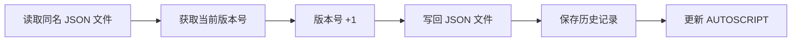

# Maximo Script Helper 使用帮助

> **注意**：目前仅支持 JavaScript 格式脚本，Python 格式脚本支持有限且未经充分测试。

---

## 📋 目录

- [启用日志](#-启用日志)
- [插件配置](#-插件配置)
- [环境管理](#-环境管理)
- [补全设置](#-补全设置)
- [手动调用接口](#-手动调用接口)
- [工具箱功能](#-工具箱功能)
- [脚本 Pull 和 Push](#-脚本-pull-和-push)

---

## 🔍 启用日志

1. 打开任意 `.js` 文件（如果看不到"日志"选项）
2. 点击底部状态栏的 **"日志"** 按钮
3. 在筛选器右侧选择 **"Maximo Script Helper"**
4. 将日志级别调整为 **"跟踪" (Trace)**
5. 现在可以看到插件的详细运行日志

---

## ⚙️ 插件配置

### 连接配置

打开配置面板：**右下角 "Maximo配置" → "连接配置"**

#### 服务器地址
```
格式：http://localhost:9080/maximo
注意：必须包含 /maximo 路径
```

#### 认证方式

**方式一：MAXAUTH（推荐）**

1. 打开浏览器开发者工具（F12）
2. 在 Console 中执行：
   ```javascript
   btoa("maxadmin:你的密码")
   ```
3. 复制生成的 Base64 字符串
4. 粘贴到配置面板的 MAXAUTH 字段

**方式二：API Key**

1. 在 Maximo 导航项中搜索 **"API"**
2. 进入 **"API KEY"** 应用
3. 创建一个新的 API Key
4. 复制 Key 值并粘贴到配置面板

#### Maximo 版本
- **推荐选择**：9.1
- ⚠️ 7.6 版本未经充分测试，可能存在兼容性问题

#### 接口方式
- **推荐选择**：API 方式
- ⚠️ OSLC 方式可能出现 "Error: Parse Error: Header overflow" 错误

#### 其他配置
- **别名（Alias Name）**：用于推送脚本时标识操作者
- **脚本存放目录**：默认 `masscript`，可自定义

### 测试连接

1. 填写完配置后，点击 **"测试连接"**
2. 如果出现错误：
   - 查看右下角 **"日志" → "输出"**
   - 找到插件日志中的 URL 和 HTTP 文件
   - 使用 Postman 等工具测试该接口
   - 确保 Maximo 中相应的功能已启用

### 初始化工具脚本

连接成功后：
1. 切换到 **"工具箱"** 标签页
2. 点击 **"初始化脚本"**
3. 等待脚本自动部署到 Maximo 系统

---

## 🌍 环境管理

### 功能简介

环境管理功能允许您保存多个 Maximo 服务器配置（如开发环境、测试环境、生产环境），并快速切换。

**配置文件位置**：`C:\Users\jiang\.sks\maximo-script-helper\envs.json`

> ⚠️ **注意**：直接修改 `envs.json` 文件不会即时生效，需要通过界面操作。

### 环境命名规范

- ✅ **推荐使用**：英文字母、数字、下划线 `_`、连字符 `-`
- ❌ **避免使用**：中文、特殊符号、空格
- 💡 **示例**：`dev`、`test`、`production`、`local-server`、`uat_env`

### 创建新环境

**步骤：**

1. 打开配置面板（右下角 "Maximo配置" → "连接配置"）
2. 填写连接信息：
   - 服务器地址
   - 认证方式（MAXAUTH 或 API Key）
   - Maximo 版本
   - 接口方式
3. 在**环境名称**输入框中输入新环境名（例如：`production`）
4. 点击右侧的 **"保存环境"** 按钮
5. 提示"环境配置已保存"即表示成功

**示例：**
```
当前环境: production
┌──────────────────────────┬─────────┬──────────┐
│ production               │ 切换环境 │ 保存环境 │
└──────────────────────────┴─────────┴──────────┘
```

### 切换环境

**步骤：**

1. 点击 **"切换环境"** 按钮
2. 弹出环境选择对话框，显示所有已保存的环境
3. 找到目标环境，点击该行的 **"加载"** 按钮
4. 界面会自动更新为所选环境的配置
5. **同时会保存到 VSCode 配置中**，重新加载窗口后自动恢复

**对话框界面：**
```
┌──────────────────────────────────────┐
│ 选择环境                         ✖  │
├──────────────────────────────────────┤
│ dev                                  │
│ ┌──────┐ ┌──────┐                   │
│ │ 加载 │ │ 删除 │                   │
│ └──────┘ └──────┘                   │
├──────────────────────────────────────┤
│ test (当前)                          │
│ ┌──────┐ ┌──────┐                   │
│ │ 加载 │ │ 删除 │                   │
│ └──────┘ └──────┘                   │
├──────────────────────────────────────┤
│ production                           │
│ ┌──────┐ ┌──────┐                   │
│ │ 加载 │ │ 删除 │                   │
│ └──────┘ └──────┘                   │
└──────────────────────────────────────┘
```

### 修改环境名称

**重要说明：**

- 修改环境名称后点击"保存环境"，会**创建一个新环境**
- 原环境仍然保留，不会被覆盖或删除
- 如果需要删除旧环境，请使用删除功能

**示例流程：**
```
1. 当前环境名: dev
2. 修改为: development
3. 点击"保存环境"
4. 结果: 同时存在 dev 和 development 两个环境
```

### 删除环境

**步骤：**

1. 点击 **"切换环境"** 按钮打开对话框
2. 找到要删除的环境
3. 点击该行的 **"删除"** 按钮
4. 弹出确认对话框（红色警告样式）
5. 点击 **"删除"** 确认，或 **"取消"** 放弃

**⚠️ 警告：**
- 删除操作**不可恢复**！
- 删除前请确认不再需要该环境配置
- 建议先备份 `envs.json` 文件

### 密码显示/隐藏

MaxAuth 和 API Key 输入框右侧有眼睛图标按钮：

- 👁️ **点击显示**：查看明文内容
- 🙈 **点击隐藏**：切换回密文显示

**用途：**
- 复制粘贴时方便查看完整内容
- 核对认证信息是否正确
- 保护敏感信息安全

### 配置持久化

**自动保存机制：**

- ✅ **切换环境后**：自动更新 VSCode 配置中的 `envnum`
- ✅ **重新加载窗口**：自动恢复最后使用的环境及其配置
- ✅ **其他字段修改**：实时自动保存（服务器地址、认证信息等）
- ❌ **环境名称输入**：不自动保存，需手动点击"保存环境"按钮

**为什么环境名称不自动保存？**

避免频繁写入 `envs.json` 文件。例如输入 "localhost" 时，如果每输入一个字符就保存，会产生 9 次不必要的文件写入操作。

### 最佳实践

1. **环境命名清晰**：使用有意义的名称，如 `dev-local`、`test-server`、`prod-main`
2. **定期备份**：重要环境的配置建议定期备份 `envs.json` 文件
3. **谨慎删除**：删除前确认是否真的不需要该环境
4. **切换即保存**：切换环境后，VSCode 配置会自动更新，无需额外操作
5. **密码安全**：使用完明文显示后，记得点击眼睛图标隐藏

---

## 💡 补全设置

### 本地 API 文档路径

用于提供离线代码补全功能。

**步骤：**
1. 下载 reflection-data：
   ```
   https://gitee.com/shoukaiseki/maximo-script-editor/tree/master/reflection-data
   ```
2. 将所有 JSON 文件保存到本地目录
3. 在配置面板中选择该目录

### JDK 路径配置

**仅在启用反射模式时需要配置**

#### JDK 路径
```
示例：D:\usr\java\jdk-17.0.1x64
要求：JDK 17 或更高版本
```

#### JAR 包配置

**方式一：目录模式（推荐）**
- 将所有必需的 JAR 包放到一个目录
- 在配置中选择该目录

**方式二：单个文件模式**
- 逐个选择必需的 JAR 包

**必需的 JAR 包列表：**

```
核心依赖：
├── maximo_client.jar
├── maximo_registry.jar
├── mboejb.jar
├── mbojava.jar
├── businessobjects.jar
└── commonweb.jar

Nashorn 引擎：
├── nashorn-core-15.6.jar
└── asm-*.jar (7.3.1)
    ├── asm-7.3.1.jar
    ├── asm-analysis-7.3.1.jar
    ├── asm-commons-7.3.1.jar
    ├── asm-tree-7.3.1.jar
    └── asm-util-7.3.1.jar

日志框架：
├── slf4j-api-2.0.11.jar
├── slf4j-simple-2.0.13.jar
├── log4j-api-2.25.3.jar
├── log4j-core-2.25.3.jar
├── log4j-1.2-api-2.25.3.jar
└── log4j-web-2.25.3.jar

其他依赖：
├── javax.xml.bind_2.2.0.v201105210648.jar
├── activation-1.1.1.jar
├── javax.mail-1.6.2.jar
├── javax.servlet-api-4.0.1.jar
├── batik-util-1.17.jar
├── beans.jar
├── icu4j.jar
├── jena-2.6.3-patched.jar
├── json4j.jar
└── oslcquery.jar
```

### JSDoc 类型注释

**开启反射模式后生效**

#### 基本用法

**示例 1：单变量类型声明**
```javascript
/** @type {psdi.mbo.MboRemote} */
var assetMbo = mbo;

// 现在输入 assetMbo. 会显示 MboRemote 的所有方法
assetMbo.getString("assetnum");
assetMbo.setValue("description", "测试");
```

**示例 2：多变量同时声明**
```javascript
/** @type {psdi.mbo.MboSetRemote} */
var locationSet, worklogSet;

// 两个变量都会获得 MboSetRemote 的类型提示
locationSet.moveFirst();
worklogSet.count();
```

**示例 3：链式调用**
```javascript
/** @type {psdi.mbo.MboRemote} */
var asset = service.getMboSet("ASSET", userInfo).moveFirst();

// 支持链式调用的类型推断
asset.getString("assetnum");
```

📖 **更多示例**：查看 [sks_demo/demo.js](https://gitee.com/shoukaiseki/maximo-script-vscode-plugin/blob/master/sks_demo/demo.js)

---

## 🔧 手动调用接口

### 准备工作

1. 下载配置文件：
   ```
   https://gitee.com/shoukaiseki/maximo-script-vscode-plugin/tree/master/public/deploy-db-json
   ```
   
   需要下载的文件：
   - `AUTOSCRIPT_PACKAGEPATH_API_CONFIG.json`
   - `IBM_AUTOSCRIPT_HISTORY_API_CONFIG.json`

2. 使用 Postman 或其他 HTTP 客户端工具

### 接口调用示例

#### 添加 AUTOSCRIPT 扩展字段

**接口地址：**
```
POST http://localhost:9080/maximo/api/script/SHARPTREE.AUTOSCRIPT.LIBRARY?develop=true&ignoreRelationships=true&ignoreAttributes=true
```

**请求头：**
```
Content-Type: application/json
apiKey: <your_api_key>
```

**请求体：**
```json
{
  "maxObjects": [
    {
      "object": "AUTOSCRIPT",
      "internal": false,
      "ignoreObjectMain": true,
      "attributes": [
        {
          "attribute": "IBM_PACKAGEPATH",
          "description": "maximo script vscode plugin中使用,会根据该字段包路径创建层级目录",
          "title": "包路径",
          "type": "ALN",
          "length": 200,
          "required": false,
          "persistent": true,
          "searchType": "WILDCARD"
        }
      ]
    },
    {
      "object": "AUTOSCRIPT",
      "internal": true,
      "ignoreObjectMain": true
    }
  ]
}
```

#### 导入域（Domain）数据

**功能说明**：批量创建或更新 Maximo 域（Domain），支持 ALN、NUMERIC、SYNONYM 等类型。

**接口地址：**
```
POST http://localhost:9080/maximo/api/script/SKS_DEPLOY_DOMAIN?lean=1
```

**请求头：**
```
Content-Type: application/json
apiKey: <your_api_key>
```

**请求体格式：**
```json
[
  {
    "domainid": "TEST_DOMAIN_TYPE",
    "domaintype": "ALN",
    "description": "测试业务类型",
    "maxtype": "UPPER",
    "internal": 0,
    "length": 30,
    "nevercache": false,
    "alndomain": [
      {
        "value": "TYPE_A",
        "description": "类型A"
      },
      {
        "value": "TYPE_B",
        "description": "类型B"
      },
      {
        "value": "TYPE_C",
        "description": "类型C"
      }
    ]
  },
  {
    "domainid": "TEST_STATUS",
    "domaintype": "ALN",
    "description": "测试状态域",
    "maxtype": "UPPER",
    "internal": 0,
    "length": 20,
    "nevercache": false,
    "alndomain": [
      {
        "value": "NEW",
        "description": "新建"
      },
      {
        "value": "IN_PROGRESS",
        "description": "处理中"
      },
      {
        "value": "COMPLETED",
        "description": "已完成"
      },
      {
        "value": "CANCELLED",
        "description": "已取消"
      }
    ]
  },
  {
    "_delete": true,
    "domainid": "OLD_DOMAIN_TO_DELETE",
    "domaintype": "ALN",
    "description": "要删除的旧域"
  }
]
```

**字段说明：**

| 字段 | 类型 | 必填 | 说明 |
|------|------|------|------|
| `domainid` | String | ✅ | 域的唯一标识符 |
| `domaintype` | String | ✅ | 域类型：`ALN`（字母数字）、`NUMERIC`（数字）、`SYNONYM`（同义词） |
| `description` | String | ✅ | 域的描述 |
| `maxtype` | String | ❌ | 数据类型：`UPPER`（大写）、`LOWER`（小写）、`MAXTYPE`（保持原样） |
| `internal` | Number | ❌ | 是否内部域：`0`（否）、`1`（是），默认 `0` |
| `length` | Number | ❌ | 字段长度，仅 ALN 类型需要 |
| `nevercache` | Boolean | ❌ | 是否永不缓存，默认 `false` |
| `alndomain` | Array | ⚠️ | ALN 类型的值列表，包含 `value` 和 `description` |
| `numericdomain` | Array | ⚠️ | NUMERIC 类型的值列表，包含 `value` 和 `description` |
| `synonymdomain` | Array | ⚠️ | SYNONYM 类型的值列表，包含 `value`、`description` 和 `maxvalue` |
| `_delete` | Boolean | ❌ | 设置为 `true` 时删除该域 |

**注意事项：**

1. **数组格式**：请求体必须是 JSON 数组，可以一次性导入多个域
2. **域类型匹配**：确保 `domaintype` 与对应的子数组匹配（ALN → alndomain，NUMERIC → numericdomain，SYNONYM → synonymdomain）
3. **删除操作**：设置 `_delete: true` 可以删除指定的域，其他字段可选
4. **更新操作**：如果域已存在，会自动更新；不存在则创建
5. **幂等性**：多次执行相同请求不会产生重复数据

**cURL 示例：**
```bash
curl --request POST \
  --url 'http://localhost:9080/maximo/api/script/SKS_DEPLOY_DOMAIN?lean=1' \
  --header 'Content-Type: application/json' \
  --header 'MAXAUTH: bWF4YWRtaW46MTIzNDU2' \
  --data '[
  {
    "domainid": "TEST_PRIORITY",
    "domaintype": "ALN",
    "description": "优先级测试域",
    "maxtype": "UPPER",
    "internal": 0,
    "length": 10,
    "nevercache": false,
    "alndomain": [
      {"value": "HIGH", "description": "高优先级"},
      {"value": "MEDIUM", "description": "中优先级"},
      {"value": "LOW", "description": "低优先级"}
    ]
  }
]'
```

### 配置文件说明

#### AUTOSCRIPT_PACKAGEPATH_API_CONFIG.json

**用途**：在 AUTOSCRIPT 表中添加 `IBM_PACKAGEPATH` 字段

**功能说明**：
- 类似于 Java 的包名称（如 `com.example.script`）
- 在 Pull 脚本功能中使用，用于创建层级目录结构
- 例如：`cn.shoukaiseki.test` → `cn/shoukaiseki/test/`

**注意事项**：
1. 首次执行时，需要将 `internal` 设为 `false`（允许添加字段）
2. 添加字段后，再将 `internal` 改回 `true`
3. `ignoreObjectMain: true` 用于修改 `internal` 属性

#### IBM_AUTOSCRIPT_HISTORY_API_CONFIG.json

**用途**：创建 `IBM_AUTOSCRIPT_HISTORY` 表

**功能说明**：
- 存储脚本的历史版本记录
- 记录版本号、操作者、时间戳等信息
- 配合 Push 功能使用

📖 **详细说明**：[public/README.md](https://gitee.com/shoukaiseki/maximo-script-vscode-plugin/blob/master/public/README.md)

---

## 🧰 工具箱功能

### 导出脚本

**功能**：备份 Maximo 系统中所有自动化脚本

**操作步骤**：
1. 点击 **"导出所有脚本"**
2. 选择备份目录
3. 等待导出完成

**输出格式**：
每个脚本生成两个文件：
- `<脚本名>.json` - AUTOSCRIPT 表属性信息（不包含 SOURCE）
- `<脚本名>.js` - 脚本源代码（SOURCE 内容）

**目录结构**：
```
autoscript_backup_20260521_143000/
├── SCRIPT1.json
├── SCRIPT1.js
├── SCRIPT2.json
├── SCRIPT2.js
└── ...
```

### 导入脚本

**功能**：将导出的脚本重新导入到 Maximo 系统

**前提条件**：
- 脚本必须是按照导出格式组织的
- 建议先进行备份

### 清除脚本

**⚠️ 警告**：此操作不可逆，请务必先备份！

**功能**：删除系统中指定的脚本

**配置文件格式**：
```json
[
  "sharptree.autoscript.admin",
  "sharptree.autoscript.deploy",
  "sharptree.autoscript.extract",
  "sharptree.autoscript.form",
  "sharptree.autoscript.install",
  "sharptree.autoscript.library",
  "sharptree.autoscript.logging",
  "sharptree.autoscript.report",
  "sharptree.autoscript.screens",
  "SHARPTREE.AUTOSCRIPT.DEPLOY.HISTORY",
  "sharptree.autoscript.store",
  "TEST01"
]
```

---

## 📥 脚本 Pull 和 Push

### 前置配置

在 **"其它配置"** 中设置：
- **脚本存放目录**：默认 `masscript`（下文均以此为例）
- **别名**：用于 Push 时标识操作者

### Pull（拉取脚本）

**操作步骤**：
1. 打开配置面板 → **"查询脚本"**
2. 点击 **"查询"** 按钮加载脚本列表
3. 使用搜索框过滤脚本（支持缓存搜索）
4. 点击目标脚本右侧的 **"Pull"** 按钮

**目录结构**：
根据脚本的 `IBM_PACKAGEPATH` 属性自动创建层级目录：

```
masscript/
└── cn/
    └── shoukaiseki/
        └── test/
            ├── TESTSCRIPT.json
            └── TESTSCRIPT.js
```

**文件说明**：
- `TESTSCRIPT.json` - 脚本元数据（与导出格式一致）
- `TESTSCRIPT.js` - 脚本源代码

**示例**：
- `IBM_PACKAGEPATH`: `cn.shoukaiseki.test`
- 创建目录：`masscript/cn/shoukaiseki/test/`
- 保存文件：`TESTSCRIPT.json` 和 `TESTSCRIPT.js`

### Push（推送脚本）

**操作步骤**：
1. 在编辑器中打开要推送的 `.js` 文件
2. 右键点击编辑器 → **"Maximo Script: 推送到 Maximo"**

**工作流程**：



**详细说明**：

1. **读取版本信息**
   - 查找同名的 `.json` 配置文件
   - 读取 `version` 字段（格式：`1.0.1`）

2. **递增版本号**
   - 提取最后一位数字
   - 自动 +1（例如：`1.0.1` → `1.0.2`）
   - 写回 JSON 文件

3. **保存历史记录**
   - 调用接口：`/maximo/api/script/SKS_AUTOSCRIPT_HISTORY_SAVE`
   - 记录内容：
     - 版本号
     - 主机名
     - 别名（操作者）
     - 时间戳

4. **更新脚本**
   - 更新 `AUTOSCRIPT` 表的以下字段：
     - `SOURCE` - 脚本源代码
     - `VERSION` - 新版本号

---

## ❓ 常见问题

### Q1: 连接测试失败怎么办？

**A**: 
1. 检查服务器地址是否正确（必须包含 `/maximo`）
2. 确认认证信息有效（MAXAUTH 或 API Key）
3. 查看日志输出，获取详细的错误信息
4. 使用 Postman 测试接口，确认 Maximo 服务正常

### Q2: 代码补全不工作？

**A**:
1. 确认已配置本地 API 文档路径
2. 检查 JSDoc 注释格式是否正确
3. 确认文件扩展名为 `.js`
4. 查看日志，确认类型推断是否成功

### Q3: Push 时版本号没有递增？

**A**:
1. 确认存在同名的 `.json` 配置文件
2. 检查 `version` 字段格式（必须是 `x.x.x` 格式）
3. 确认最后一位是数字

### Q4: Pull 时目录结构不正确？

**A**:
1. 检查脚本的 `ibm_packagepath` 字段是否存在
2. 确认字段值为点号分隔的格式（如 `com.example`）
3. 查看日志，确认目录创建过程

---

## 📞 获取帮助

- 📖 [项目主页](https://gitee.com/shoukaiseki/maximo-script-vscode-plugin)
- 🐛 [问题反馈](https://gitee.com/shoukaiseki/maximo-script-vscode-plugin/issues)
- 📝 [更新日志](https://gitee.com/shoukaiseki/maximo-script-vscode-plugin/blob/master/CHANGELOG.md)
- 📚 [Skills 文档](https://gitee.com/shoukaiseki/maximo-script-vscode-plugin/tree/master/AIDOC/SKILLS)
---

*最后更新：2026-05-27 | 版本：1.2.7*
